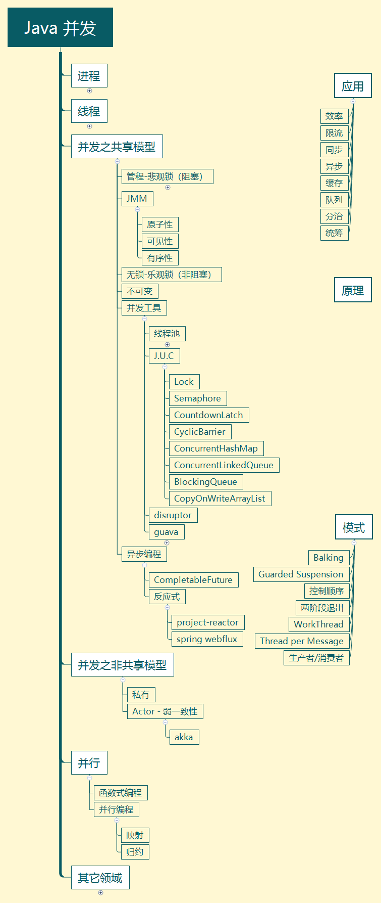

# 第1章 并发编程概览

## 1.1 这门课讲什么

这门课中的【并发】一词涵盖了在 Java 平台上的

- 进程 
- 线程 
- 并发 
- 并行

以及 Java 并发工具、并发问题以及解决方案，同时我也会讲解一些其它领域的并发

## 1.2 为什么学这么课

我工作中用不到并发啊？

## 1.3 课程特色

本门课程以并发、并行为主线，穿插讲解

- 应用 - 结合实际 
- 原理 - 了然于胸 
- 模式 - 正确姿势




## 1.4 预备知识

- 希望你不是一个初学者 
- 线程安全问题，需要你接触过 Java Web 开发、Jdbc 开发、Web 服务器、分布式框架时才会遇到
- 基于 JDK 8，最好对函数式编程、lambda 有一定了解 
- 采用了 slf4j 打印日志，这是好的实践 
- 采用了 lombok 简化 java bean 编写 
- 给每个线程好名字，这也是一项好的实践

pom.xml 依赖如下

```xml
<dependencies>
    <dependency>
        <groupId>org.projectlombok</groupId>
        <artifactId>lombok</artifactId>
        <version>1.18.10</version>
    </dependency>
    <dependency>
        <groupId>ch.qos.logback</groupId>
        <artifactId>logback-classic</artifactId>
        <version>1.2.3</version>
    </dependency>
</dependencies>
```

logback.xml 配置如下

```xml
<?xml version="1.0" encoding="UTF-8"?>
<configuration
        xmlns="http://ch.qos.logback/xml/ns/logback"
        xmlns:xsi="http://www.w3.org/2001/XMLSchema-instance"
        xsi:schemaLocation="http://ch.qos.logback/xml/ns/logback logback.xsd">
    <appender name="STDOUT" class="ch.qos.logback.core.ConsoleAppender">
        <encoder>
            <!--%date{HH:mm:ss.SSS} %c -->
            <pattern>%date{HH:mm:ss.SSS} %c [%t] - %m%n</pattern>
        </encoder>
    </appender>
    <logger name="c" level="debug" additivity="false">
        <appender-ref ref="STDOUT"/>
    </logger>

    <root level="ERROR">
        <appender-ref ref="STDOUT"/>
    </root>
</configuration>
```

