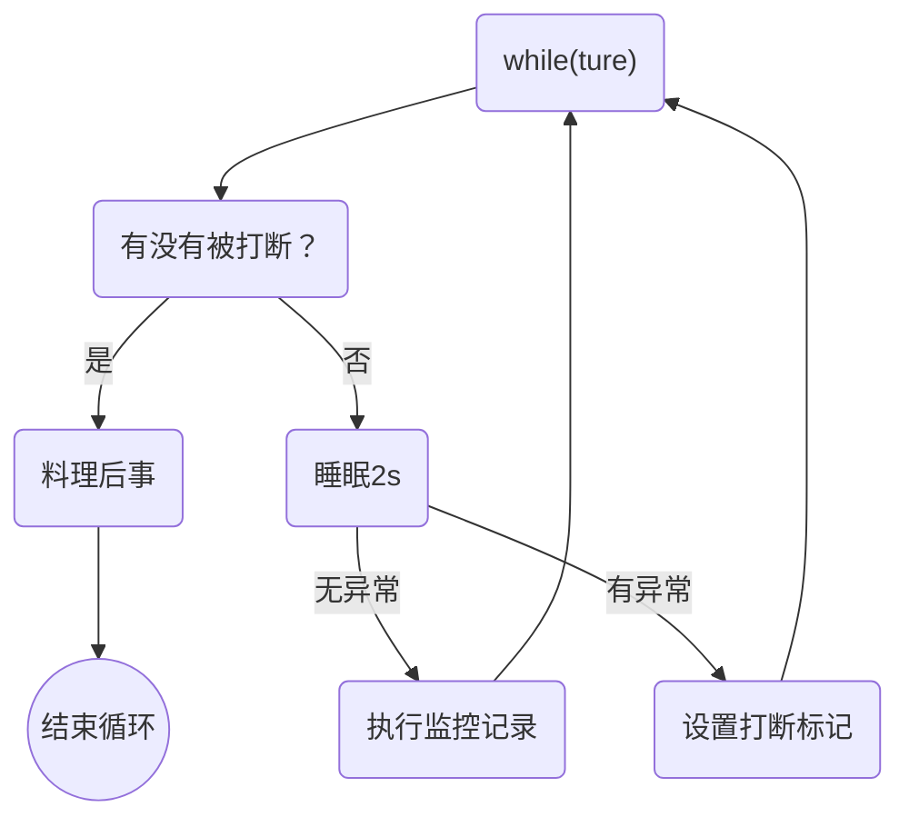
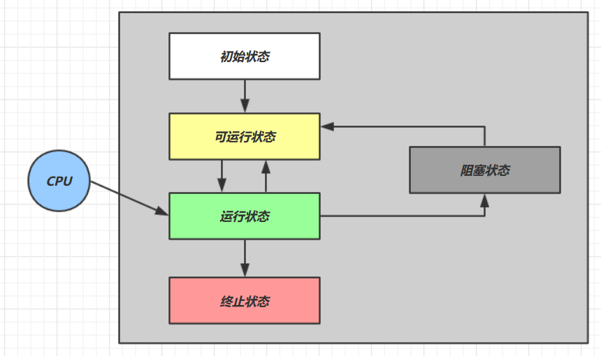
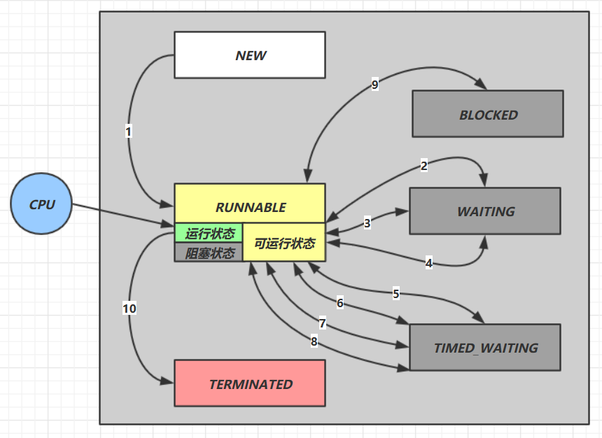

# 第3章 Java线程

本章内容

- 创建和运行线程 
- 查看线程 
- 线程 API 
- 线程状态

## 3.1 创建和运行线程 

### 方法一，直接使用 Thread

```java
// 创建线程对象
Thread t = new Thread() {
    @Override
    public void run() {
        // 要执行的任务
        log.debug("running");
    }
};
// 给线程指定名字
t.setName("t1");
// 启动线程
t.start();
```


### 方法二，使用 Runnable 配合 Thread

```java
Runnable r = new Runnable() {
    @Override
    public void run() {
		// 要执行的任务
    	log.debug("running");
    }
}
// 创建线程对象并执行名字
Thread t = new Thread(r, "t2");
// 启动线程
t.start();
```

Java 8 以后可以使用 lambda 精简代码

```java
Runnable r = () -> {
	// 要执行的任务
    log.debug("running");
};
```


#### 原理之 Thread 与 Runnable 的关系

分析 Thread 的源码，理清它与 Runnable 的关系

小结

-  方法1 是把线程和任务合并在了一起，方法2 是把线程和任务分开了 
-  用 Runnable 更容易与线程池等高级 API 配合 
-  用 Runnable 让任务类脱离了 Thread 继承体系，更灵活

### 方法三，FutureTask 配合 Thread

FutureTask 能够接收 Callable 类型的参数，用来处理有返回结果的情况

```java
// 创建任务对象
FutureTask<Integer> task3 = new FutureTask<>(() -> {
    log.debug("hello");
    return 100;
});

// 参数1 是任务对象; 参数2 是线程名字
new Thread(task3, "t3").start();

// 主线程阻塞，同步等待 task 执行完毕的结果 
Integer result = null;
try {
    result = task3.get();
} catch (InterruptedException | ExecutionException e) {
    e.printStackTrace();
}
log.debug("结果是:{}", result);
```


## 3.2 观察多个线程同时运行

主要是理解

- 交替执行 
- 谁先谁后，不由我们控制

```java
public static void main(String[] args) {
    new Thread(() -> {
        while (true) {
            log.debug("running...");
        }
    }, "t1").start();

    new Thread(() -> {
        while (true) {
            log.debug("running...");
        }
    }, "t2").start();
}
```


## 3.3 查看进程线程的方法

### windows

- 任务管理器可以查看进程和线程数，也可以用来杀死进程 

- `tasklist` 查看进程 

- `taskkill`杀死进程

### linux

- `ps -fe` 查看所有进程 
- `ps -fT -p <PID>` 查看某个进程（PID）的所有线程 
- `kill` 杀死进程 
- `top` 按大写 H 切换是否显示线程 
- `top -H -p <PID>` 查看某个进程（PID）的所有线程

### Java

- `jps` 命令查看所有 Java 进程
- `jstack <PID>` 查看某个 Java 进程（PID）的所有线程状态 
- `jconsole` 来查看某个 Java 进程中线程的运行情况（图形界面）

jconsole 远程监控配置

- 需要以如下方式运行你的 java 类

```shell
java -Djava.rmi.server.hostname=`ip地址` -Dcom.sun.management.jmxremote -Dcom.sun.management.jmxremote.port=`连接端口` -Dcom.sun.management.jmxremote.ssl=是否安全连接 -Dcom.sun.management.jmxremote.authenticate=是否认证 java类
```

如果要认证访问，还需要做如下步骤

- 复制 jmxremote.password 文件 
- 修改 jmxremote.password 和 jmxremote.access 文件的权限为 600 即文件所有者可读写 
- 连接时填入 controlRole（用户名），R&D（密码）


## 3.4 原理之线程运行

### 栈与栈帧

Java Virtual Machine Stacks （Java 虚拟机栈）

我们都知道 JVM 中由堆、栈、方法区所组成，其中栈内存是给谁用的呢？其实就是线程，每个线程启动后，虚拟机就会为其分配一块栈内存。

- 每个栈由多个栈帧（Frame）组成，对应着每次方法调用时所占用的内存 
- 每个线程只能有一个活动栈帧，对应着当前正在执行的那个方法

### 线程上下文切换（Thread Context Switch）

因为以下一些原因导致 cpu 不再执行当前的线程，转而执行另一个线程的代码

- 线程的 cpu 时间片用完 
- 垃圾回收 
- 有更高优先级的线程需要运行 
- 线程自己调用了 sleep、yield、wait、join、park、synchronized、lock 等方法

当 Context Switch 发生时，需要由操作系统保存当前线程的状态，并恢复另一个线程的状态，Java 中对应的概念就是程序计数器（Program Counter Register），它的作用是记住下一条 jvm 指令的执行地址，是线程私有的

- 状态包括程序计数器、虚拟机栈中每个栈帧的信息，如局部变量、操作数栈、返回地址等 
- Context Switch 频繁发生会影响性能

## 3.5 常见方法

| 方法名           | static | 功能说明                                          | 注意                                                         |
| ---------------- | ------ | ------------------------------------------------- | ------------------------------------------------------------ |
| start()          |        | 启动一个新线程，在新的线程 运行 run 方法 中的代码 | start 方法只是让线程进入就绪，里面代码不一定立刻运行（CPU 的时间片还没分给它）。每个线程对象的 start方法只能调用一次，如果调用了多次会出现 IllegalThreadStateException |
| run()            |        | 新线程启动后会 调用的方法                         | 如果在构造 Thread 对象时传递了 Runnable 参数，则线程启动后会调用 Runnable 中的 run 方法，否则默认不执行任何操作。但可以创建 Thread 的子类对象，来覆盖默认行为 |
| join()           |        | 等待线程运行结束                                  |                                                              |
| join(long)       |        | 等待线程运行结束,最多等待 n 毫秒                  |                                                              |
| getId()          |        | 获取线程长整型的 id                               | id 唯一                                                      |
| getName  |        | 获取线程名 ||
| setName(String)  |        | 修改线程名 |                                                              |
| getPriority()    |        | 获取线程优先级 |                                                              |
| setPriority(int) |        | 修改线程优先级 | java中规定线程优先级是1~10 的整数，较大的优先级能提高该线程被 CPU 调度的机率 |
| getState()       |        | 获取线程状态 | Java 中线程状态是用 6 个 enum 表示，分别为： NEW, RUNNABLE, BLOCKED, WAITING, TIMED_WAITING, TERMINATED |
| isInterrupted()  |        | 判断是否被打断 | 不会清除打断标记 |
| isAlive()        |        | 线程是否存活（还没有运行完毕） |                                                              |
| interrupt()      |        | 打断线程 | 如果被打断线程正在 sleep，wait，join 会导致被打断的线程抛出 InterruptedException，并清除打断标记 ；如果打断的正在运行的线程，则会设置打断标记 ；park 的线程被打断，也会设置打断标记 |
| interrupted()    | static | 判断当前线程是否被打断 | 会清除打断标记 |
| currentThread()  | static | 获取当前正在执行的线程 |                                                              |
| sleep(long)      | static | 让当前执行的线程休眠n毫秒， 休眠时让出 cpu 的时间片给其它线程 |                                                              |
| yield()          | static | 提示线程调度器让出当前线程对 CPU的使用 | 主要是为了测试和调试 |

## 3.6 start 与 run

### 调用 run

```java
public static void main(String[] args) {
    read2();
}

public static void read2() {
    Thread t1 = new Thread("t1") {
        @Override
        public void run() {
            log.debug(Thread.currentThread().getName());
            FileReader.read(Constants.MP4_FULL_PATH);
        }
    };
    t1.run();
    log.debug("do other things ...");
}
```

运行结果

```shell
18:50:09.822 c.Async [main] - main
18:50:09.826 c.FileReader [main] - read [a-big-file.mp4] start ...
18:50:09.944 c.FileReader [main] - read [a-big-file.mp4] end ... cost: 119 ms
18:50:09.945 c.Async [main] - do other things ...
```

程序仍在 main 线程运行， FileReader.read() 方法调用还是同步的


### 调用 start

```java
public static void main(String[] args) {
    read1();
}

public static void read1() {
    Thread t1 = new Thread("t1") {
        @Override
        public void run() {
            log.debug(Thread.currentThread().getName());
            FileReader.read(Constants.MP4_FULL_PATH);
        }
    };
    t1.start();
    log.debug("do other things ...");
}
```

运行结果

```shell
19:15:50.626 c.Async [main] - do other things ...
19:15:50.626 c.Async [t1] - t1
19:15:50.629 c.FileReader [t1] - read [a-big-file.mp4] start ...
19:15:50.764 c.FileReader [t1] - read [a-big-file.mp4] end ... cost: 135 ms
```

程序在 t1 线程运行， FileReader.read() 方法调用是异步的

### 小结

- 直接调用 run 是在主线程中执行了 run，没有启动新的线程 
- 使用 start 是启动新的线程，通过新的线程间接执行 run 中的代码

## 3.7 sleep 与 yield

### sleep

1. 调用 sleep 会让当前线程从 Running 进入 Timed Waiting 状态（阻塞）

2. 其它线程可以使用 interrupt 方法打断正在睡眠的线程，这时 sleep 方法会抛出 InterruptedException

3. 睡眠结束后的线程未必会立刻得到执行

4. 建议用 TimeUnit 的 sleep 代替 Thread 的 sleep 来获得更好的可读性

### yield

1. 调用 yield 会让当前线程从 Running 进入 Runnable 就绪状态，然后调度执行其它线程

2. 具体的实现依赖于操作系统的任务调度器

### 线程优先级

- 线程优先级会提示（hint）调度器优先调度该线程，但它仅仅是一个提示，调度器可以忽略它 
- 如果 cpu 比较忙，那么优先级高的线程会获得更多的时间片，但 cpu 闲时，优先级几乎没作用

```java
public static void main(String[] args) {
    Runnable task1 = () -> {
        int count = 0;
        for (; ; ) {
            System.out.println("---->1 " + count++);
        }
    };
    Runnable task2 = () -> {
        int count = 0;
        for (; ; ) {
            // Thread.yield();
            System.out.println("              ---->2 " + count++);
        }
    };
    Thread t1 = new Thread(task1, "t1");
    Thread t2 = new Thread(task2, "t2");
    t1.setPriority(Thread.MIN_PRIORITY);
    t2.setPriority(Thread.MAX_PRIORITY);
    t1.start();
    t2.start();
}
```


## 3.8 join 方法详解

### 为什么需要 join

下面的代码执行，打印 r 是什么？

```java

static int r = 0;

public static void main(String[] args) throws InterruptedException {
    test1();
}

private static void test1() throws InterruptedException {
    log.debug("开始");
    Thread t1 = new Thread(() -> {
        log.debug("开始");
        sleep(1);
        log.debug("结束");
        r = 10;
    }, "t1");
    t1.start();
    // t1.join();
    log.debug("结果为:{}", r);
    log.debug("结束");
}
```

分析

- 因为主线程和线程 t1 是并行执行的，t1 线程需要 1 秒之后才能算出 r=10 
- 而主线程一开始就要打印 r 的结果，所以只能打印出 r=0

解决方法

- 用 sleep 行不行？为什么？ 
- 用 join，加在 t1.start() 之后即可

### 等待多个结果

问，下面代码 cost 大约多少秒？

```java
static int r1 = 0;
static int r2 = 0;

public static void main(String[] args) throws InterruptedException {
    test2();
}

private static void test2() throws InterruptedException {
    Thread t1 = new Thread(() -> {
        sleep(1);
        r1 = 10;
    });
    Thread t2 = new Thread(() -> {
        sleep(2);
        r2 = 20;
    });
    t1.start();
    t2.start();
    long start = System.currentTimeMillis();
    log.debug("join begin");
    t2.join();
    log.debug("t2 join end");
    t1.join();
    log.debug("t1 join end");
    long end = System.currentTimeMillis();
    log.debug("r1: {} r2: {} cost: {}", r1, r2, end - start);
}
```

分析如下 

- 第一个 join：等待 t1 时, t2 并没有停止, 而在运行

- 第二个 join：1s 后, 执行到此, t2 也运行了 1s, 因此也只需再等待 1s 

如果颠倒两个 join 呢？

一样的 

### 有时效的 join

等够时间

```java
static int r1 = 0;
static int r2 = 0;

public static void main(String[] args) throws InterruptedException {
    test3();
}

public static void test3() throws InterruptedException {
    Thread t1 = new Thread(() -> {
        sleep(2);
        r1 = 10;
    });

    long start = System.currentTimeMillis();
    t1.start();

    // 线程执行结束会导致 join 结束
    log.debug("join begin");
    t1.join(3000);
    long end = System.currentTimeMillis();
    log.debug("r1: {} r2: {} cost: {}", r1, r2, end - start);
}
```

输出结果

```shell
19:47:49.112 c.TestJoin [main] - join begin
19:47:51.115 c.TestJoin [main] - r1: 10 r2: 0 cost: 2005
```

没等够时间

```java
static int r1 = 0;
static int r2 = 0;

public static void main(String[] args) throws InterruptedException {
    test3();
}

public static void test3() throws InterruptedException {
    Thread t1 = new Thread(() -> {
        sleep(2);
        r1 = 10;
    });

    long start = System.currentTimeMillis();
    t1.start();

    // 线程执行结束会导致 join 结束
    log.debug("join begin");
    t1.join(1500);
    long end = System.currentTimeMillis();
    log.debug("r1: {} r2: {} cost: {}", r1, r2, end - start);
}
```

输出结果

```shell
19:50:10.855 c.TestJoin [main] - join begin
19:50:12.363 c.TestJoin [main] - r1: 0 r2: 0 cost: 1511
```


## 3.9 interrupt 方法详解

### 打断 sleep，wait，join 的线程

这几个方法都会让线程进入阻塞状态 

打断 sleep 的线程, 会清空打断状态，以 sleep 为例

```java
public static void main(String[] args) throws InterruptedException {
    Thread t1 = new Thread(() -> {
        log.debug("sleep...");
        try {
            Thread.sleep(5000); // wait, join
        } catch (InterruptedException e) {
            e.printStackTrace();
        }
    }, "t1");

    t1.start();
    Thread.sleep(1000);
    log.debug("interrupt");
    t1.interrupt();
    log.debug("打断标记:{}", t1.isInterrupted());
}
```

输出

```shell
19:54:55.997 c.Test11 [t1] - sleep...
19:54:56.995 c.Test11 [main] - interrupt
19:54:56.996 c.Test11 [main] - 打断标记:true
java.lang.InterruptedException: sleep interrupted
	at java.lang.Thread.sleep(Native Method)
	at cn.itcast.test.Test11.lambda$main$0(Test11.java:12)
	at java.lang.Thread.run(Thread.java:748)
```


### 打断正常运行的线程

打断正常运行的线程, 不会清空打断状态

```java
public static void main(String[] args) throws InterruptedException {
    Thread t1 = new Thread(() -> {
        while (true) {
            boolean interrupted = Thread.currentThread().isInterrupted();
            if (interrupted) {
                log.debug("被打断了, 退出循环");
                break;
            }
        }
    }, "t1");
    t1.start();

    Thread.sleep(1000);
    log.debug("interrupt");
    t1.interrupt();
}
```

输出

```
19:56:11.917 c.Test12 [main] - interrupt
19:56:11.920 c.Test12 [t1] - 被打断了, 退出循环
```


### 模式之两阶段终止




```java
@Slf4j(topic = "c.TwoPhaseTermination")
public class Test13 {

    public static void main(String[] args) throws InterruptedException {
        TwoPhaseTermination tpt = new TwoPhaseTermination();
        tpt.start();

        Thread.sleep(3500);
        log.debug("停止监控");
        tpt.stop();
    }
}

@Slf4j(topic = "c.TwoPhaseTermination")
class TwoPhaseTermination {
    // 监控线程
    private Thread monitorThread;

    // 启动监控线程
    public void start() {
        monitorThread = new Thread(() -> {
            while (true) {
                Thread current = Thread.currentThread();
                // 是否被打断
                if (current.isInterrupted()) {
                    log.debug("料理后事");
                    break;
                }
                try {
                    Thread.sleep(1000);
                    log.debug("执行监控记录");
                } catch (InterruptedException e) {
                    // 因为 sleep 出现异常后，会清除打断标记
                    // 需要重置打断标记
                    current.interrupt();
                }
            }
        }, "monitor");
        monitorThread.start();
    }

    // 停止监控线程
    public void stop() {
        monitorThread.interrupt();
    }
}
```


### 打断 park 线程

打断 park 线程, 不会清空打断状态

```java
private static void test3() {
    Thread t1 = new Thread(() -> {
        log.debug("park...");
        LockSupport.park();
        log.debug("unpark...");
        log.debug("打断状态：{}", Thread.currentThread().isInterrupted());
    }, "t1");
    t1.start();

    sleep(1);
    t1.interrupt();
}

public static void main(String[] args) {
    test3();
}
```

输出

```shell
20:26:40.800 c.Test14 [t1] - park...
20:26:41.802 c.Test14 [t1] - unpark...
20:26:41.802 c.Test14 [t1] - 打断状态：true
```


## 3.10 不推荐的方法

还有一些不推荐使用的方法，这些方法已过时，容易破坏同步代码块，造成线程死锁

| 方法名    | static | 功能说明     |
| --------- | ------ | ------------ |
| stop()    |        | 停止线程运行 |
| suspend() |        | 挂起线程运行 |
| resume()  |        | 恢复线程运行 |


## 3.11 主线程与守护线程

默认情况下，Java 进程需要等待所有线程都运行结束，才会结束。有一种特殊的线程叫做守护线程，只要其它非守护线程运行结束了，即使守护线程的代码没有执行完，也会强制结束。

```java
public static void main(String[] args) {
    log.debug("开始运行...");
    Thread t1 = new Thread(() -> {
        log.debug("开始运行...");
        sleep(2);
        log.debug("运行结束...");
    }, "daemon");
    // 设置该线程为守护线程
    t1.setDaemon(true);
    t1.start();

    sleep(1);
    log.debug("运行结束...");
}
```

输出

```shell
20:32:27.395 c.TestDaemon [main] - 开始运行...
20:32:27.445 c.TestDaemon [daemon] - 开始运行...
20:32:28.449 c.TestDaemon [main] - 运行结束...
```


注意

- 垃圾回收器线程就是一种守护线程 
- Tomcat 中的 Acceptor 和 Poller 线程都是守护线程，所以 Tomcat 接收到 shutdown 命令后，不会等待它们处理完当前请求


## 3.12 五种状态

这是从 操作系统 层面来描述的




- 【初始状态】仅是在语言层面创建了线程对象，还未与操作系统线程关联 
- 【可运行状态】（就绪状态）指该线程已经被创建（与操作系统线程关联），可以由 CPU 调度执行 
- 【运行状态】指获取了 CPU 时间片运行中的状态 
    - 当 CPU 时间片用完，会从【运行状态】转换至【可运行状态】，会导致线程的上下文切换 
- 【阻塞状态】 
    - 如果调用了阻塞 API，如 BIO 读写文件，这时该线程实际不会用到 CPU，会导致线程上下文切换，进入【阻塞状态】 
    - 等 BIO 操作完毕，会由操作系统唤醒阻塞的线程，转换至【可运行状态】 
    - 与【可运行状态】的区别是，对【阻塞状态】的线程来说只要它们一直不唤醒，调度器就一直不会考虑调度它们 
- 【终止状态】表示线程已经执行完毕，生命周期已经结束，不会再转换为其它状态


## 3.13 六种状态

这是从 Java API 层面来描述的 

根据 Thread.State 枚举，分为六种状态



- NEW 线程刚被创建，但是还没有调用 start() 方法 
- RUNNABLE 当调用了 start() 方法之后，注意，**Java API** 层面的 RUNNABLE 状态涵盖了**操作系统**层面的 【可运行状态】、【运行状态】和【阻塞状态】（由于 BIO 导致的线程阻塞，在 Java 里无法区分，仍然认为是可运行） 
- BLOCKED ， WAITING ， TIMED_WAITING 都是 Java API 层面对【阻塞状态】的细分，后面会在状态转换一节详述 
- TERMINATED 当线程代码运行结束


## 3.14 习题


## 本章小结

本章的重点在于掌握

- 线程创建 
- 线程重要 api，如 start，run，sleep，join，interrupt 等 
- 线程状态 
- 应用方面 
    - 异步调用：主线程执行期间，其它线程异步执行耗时操作 
    - 提高效率：并行计算，缩短运算时间 
    - 同步等待：join 
    - 统筹规划：合理使用线程，得到最优效果 
- 原理方面 
    - 线程运行流程：栈、栈帧、上下文切换、程序计数器 
    - Thread 两种创建方式 的源码 
- 模式方面 
    - 终止模式之两阶段终止