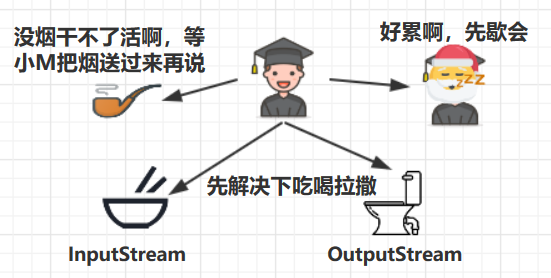
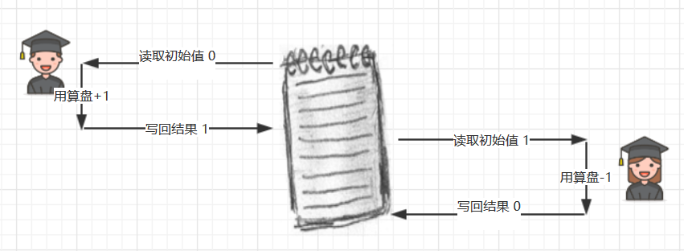
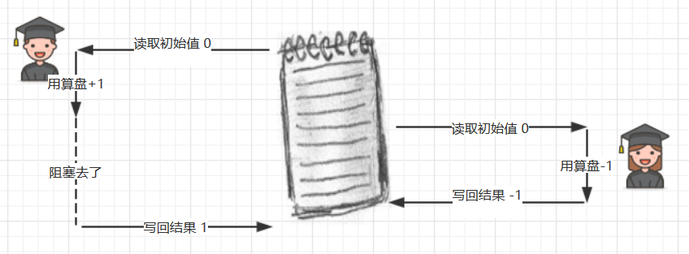
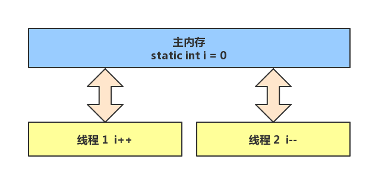
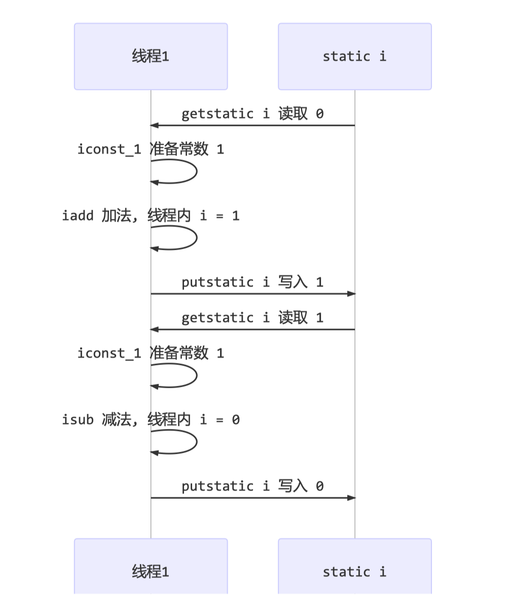
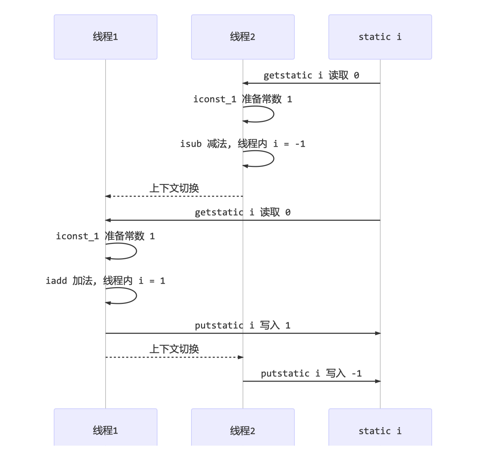
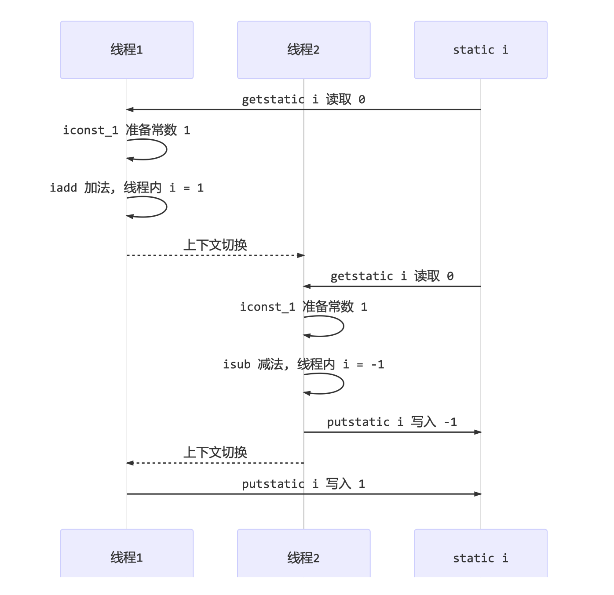
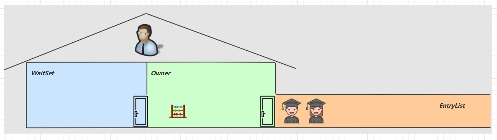
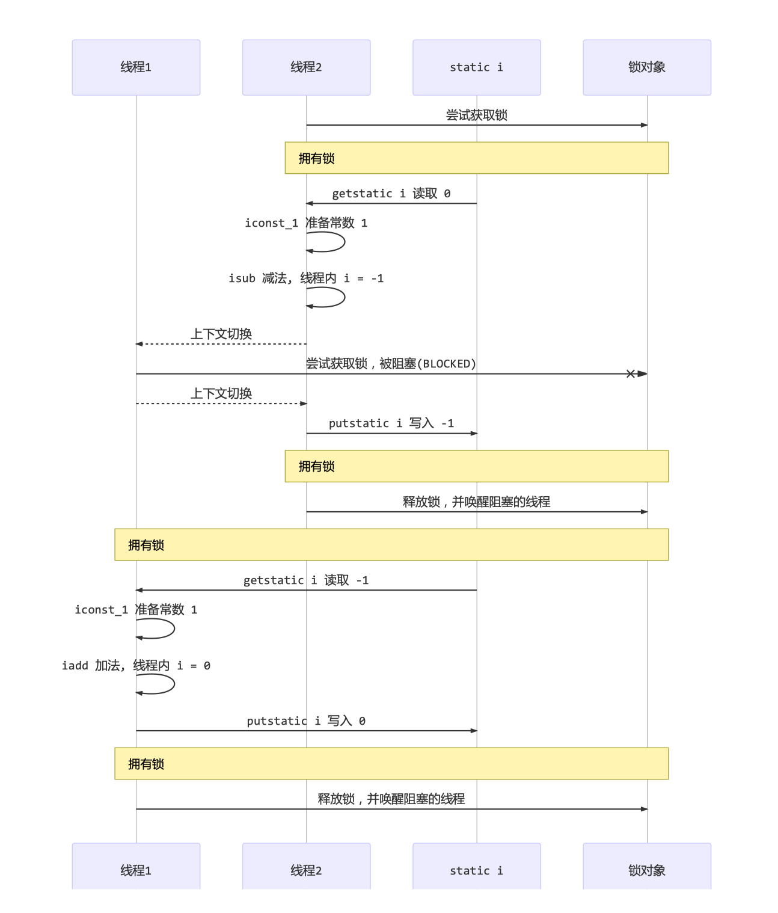

# 第4章 共享模型之管程

本章内容

- 共享问题 
- synchronized 
- 线程安全分析 
- Monitor 
- wait/notify 
- 线程状态转换 
- 活跃性 
- Lock

## 4.1 共享带来的问题

### 小故事

- 老王（操作系统）有一个功能强大的算盘（CPU），现在想把它租出去，赚一点外快
- 

- 小南、小女（线程）来使用这个算盘来进行一些计算，并按照时间给老王支付费用 
- 但小南不能一天24小时使用算盘，他经常要小憩一会（sleep），又或是去吃饭上厕所（阻塞 io 操作），有 时还需要一根烟，没烟时思路全无（wait）这些情况统称为（阻塞）
- 
- 在这些时候，算盘没利用起来（不能收钱了），老王觉得有点不划算 
- 另外，小女也想用用算盘，如果总是小南占着算盘，让小女觉得不公平 
- 于是，老王灵机一动，想了个办法 [ 让他们每人用一会，轮流使用算盘 ] 
- 这样，当小南阻塞的时候，算盘可以分给小女使用，不会浪费，反之亦然 
- 最近执行的计算比较复杂，需要存储一些中间结果，而学生们的脑容量（工作内存）不够，所以老王申请了一个笔记本（主存），把一些中间结果先记在本上
- 计算流程是这样的
- 
- 但是由于分时系统，有一天还是发生了事故 
- 小南刚读取了初始值 0 做了个 +1 运算，还没来得及写回结果 
- 老王说 [ 小南，你的时间到了，该别人了，记住结果走吧 ]，于是小南念叨着 [ 结果是1，结果是1...] 不甘心地到一边待着去了（上下文切换） 
- 老王说 [ 小女，该你了 ]，小女看到了笔记本上还写着 0 做了一个 -1 运算，将结果 -1 写入笔记本 
- 这时小女的时间也用完了，老王又叫醒了小南：[小南，把你上次的题目算完吧]，小南将他脑海中的结果 1 写入了笔记本
- 
- 小南和小女都觉得自己没做错，但笔记本里的结果是 1 而不是 0


### Java 的体现

两个线程对初始值为 0 的静态变量一个做自增，一个做自减，各做 5000 次，结果是 0 吗？

```java
static int counter = 0;

public static void main(String[] args) throws InterruptedException {
    Thread t1 = new Thread(() -> {
        for (int i = 0; i < 5000; i++) {
            counter++;
        }
    }, "t1");
    Thread t2 = new Thread(() -> {
        for (int i = 0; i < 5000; i++) {
            counter--;
        }
    }, "t2");
    t1.start();
    t2.start();
    t1.join();
    t2.join();
    log.debug("{}", counter);
}
```


### 问题分析

以上的结果可能是正数、负数、零。为什么呢？因为 Java 中对静态变量的自增，自减并不是原子操作，要彻底理解，必须从字节码来进行分析 

例如对于 i++ 而言（i 为静态变量），实际会产生如下的 JVM 字节码指令：

```
getstatic i // 获取静态变量 i 的值
iconst_1	// 准备常量 1
iadd		// 自增
putstatc	// 将修改后的值存入静态变量i
```

而对应 i-- 也是类似：

```
getstatic i // 获取静态变量 i 的值
iconst_1	// 准备常量 1
isub		// 自减
putstatc	// 将修改后的值存入静态变量i
```

而 Java 的内存模型如下，完成静态变量的自增，自减需要在主存（实际上放在方法区）和工作内存（虚拟机栈对应栈帧中的操作数栈）中进行数据交换：



如果是单线程以上 8 行代码是顺序执行（不会交错）没有问题：



但多线程下这 8 行代码可能交错运行： 

出现负数的情况：



出现正数的情况：



### 临界区 Critical Section

- 一个程序运行多个线程本身是没有问题的 

- 问题出在多个线程访问共享资源 

    - 多个线程读共享资源其实也没有问题 
    - 在多个线程对共享资源读写操作时发生指令交错，就会出现问题 

- 一段代码块内如果存在对共享资源的多线程读写操作，称这段代码块为临界区

例如，下面代码中的临界区

```java
static int counter = 0;

static void increment() { // 临界区
	counter++;
}

static void decrement() { // 临界区
	counter--;
}
```


### 竞态条件 Race Condition

多个线程在临界区内执行，由于代码的**执行序列不同**而导致结果无法预测，称之为发生了**竞态条件**


## 4.2 synchronized 解决方案

为了避免临界区的竞态条件发生，有多种手段可以达到目的。

- 阻塞式的解决方案：synchronized，Lock 
- 非阻塞式的解决方案：原子变量

本次课使用阻塞式的解决方案：synchronized，来解决上述问题，即俗称的【对象锁】，它采用互斥的方式让同一时刻至多只有一个线程能持有【对象锁】，其它线程再想获取这个【对象锁】时就会阻塞住。这样就能保证拥有锁的线程可以安全的执行临界区内的代码，不用担心线程上下文切换

> 注意
>
> 虽然 java 中互斥和同步都可以采用 synchronized 关键字来完成，但它们还是有区别的：
>
> - 互斥是保证临界区的竞态条件发生，同一时刻只能有一个线程执行临界区代码 
> - 同步是由于线程执行的先后、顺序不同、需要一个线程等待其它线程运行到某个点

### synchronized

语法

```java
synchronized(对象) // 线程1，线程2（blocked）
{
	// 临界区
}
```

解决

```java
static final Object room = new Object();
static int counter = 0;

public static void main(String[] args) throws InterruptedException {
    Thread t1 = new Thread(() -> {
        for (int i = 0; i < 5000; i++) {
            synchronized (room) {
                counter++;
            }
        }
    }, "t1");
    Thread t2 = new Thread(() -> {
        for (int i = 0; i < 5000; i++) {
            synchronized (room) {
                counter--;
            }
        }
    }, "t2");
    t1.start();
    t2.start();
    t1.join();
    t2.join();
    log.debug("{}", counter);
}
```



你可以做这样的类比：

- synchronized(对象) 中的对象，可以想象为一个房间（room），有唯一入口（门）房间只能一次进入一人进行计算，线程 t1，t2 想象成两个人
- 当线程 t1 执行到 synchronized(room) 时就好比 t1 进入了这个房间，并锁住了门拿走了钥匙，在门内执行 count++ 代码 
- 这时候如果 t2 也运行到了 synchronized(room) 时，它发现门被锁住了，只能在门外等待，发生了上下文切 换，阻塞住了 
- 这中间即使 t1 的 cpu 时间片不幸用完，被踢出了门外（不要错误理解为锁住了对象就能一直执行下去哦）， 这时门还是锁住的，t1 仍拿着钥匙，t2 线程还在阻塞状态进不来，只有下次轮到 t1 自己再次获得时间片时才 能开门进入 
- 当 t1 执行完 synchronized{} 块内的代码，这时候才会从 obj 房间出来并解开门上的锁，唤醒 t2 线程把钥 匙给他。t2 线程这时才可以进入 obj 房间，锁住了门拿上钥匙，执行它的 count-- 代码

用图来表示




### 思考

synchronized 实际是用对象锁保证了临界区内代码的原子性，临界区内的代码对外是不可分割的，不会被线程切换所打断。 

为了加深理解，请思考下面的问题

- 如果把synchronized(obj) 放在 for 循环的外面，如何理解？-- 原子性

- 如果 t1 synchronized(obj1) 而 t2 synchronized(obj2) 会怎样运作？-- 锁对象 
-  如果 t1 synchronized(obj) 而 t2 没有加会怎么样？如何理解？-- 锁对象

### 面向对象改进

把需要保护的共享变量放入一个类

```java
public class Test17 {
    
    public static void main(String[] args) throws InterruptedException {
        Room room = new Room();
        Thread t1 = new Thread(() -> {
            for (int i = 0; i < 5000; i++) {
                room.increment();
            }
        }, "t1");

        Thread t2 = new Thread(() -> {
            for (int i = 0; i < 5000; i++) {
                room.decrement();
            }
        }, "t2");

        t1.start();
        t2.start();
        t1.join();
        t2.join();
        log.debug("{}", room.getCounter());
    }
}

class Room {
    private int counter = 0;

    public synchronized void increment() {
        counter++;
    }

    public synchronized void decrement() {
        counter--;
    }

    public synchronized int getCounter() {
        return counter;
    }
}
```


## 4.3 方法上的 synchronized

```java
class Test {
	public synchronized void test () {
	
	}
}
// 等价于
class Test {
	public void test () {
		synchronized(this) {
            
        }
	}
}
```


```java
class Test {
	public synchronized static void test () {
	
	}
}
// 等价于
class Test {
	public static void test () {
		synchronized(Test.class) {
            
        }
	}
}
```


### 不加 synchronized 的方法

不加 synchronzied 的方法就好比不遵守规则的人，不去老实排队（好比翻窗户进去的）

### 所谓的“线程六锁”

其实就是考察 synchronized 锁住的是哪个对象

#### 情况一：先1后2 或 先2后1

```java
@Slf4j(topic = "c.Test8Locks")
public class Test8Locks {
    public static void main(String[] args) {
        Number n1 = new Number();
        new Thread(n1::a).start();
        new Thread(n1::b).start();
    }
}

@Slf4j(topic = "c.Number")
class Number {
    public synchronized void a() {
        log.debug("1");
    }

    public synchronized void b() {
        log.debug("2");
    }
}
```

#### 情况二：先1s1后2 或 先2后1s1

```java
@Slf4j(topic = "c.Test8Locks")
public class Test8Locks {
    public static void main(String[] args) {
        Number n1 = new Number();
        new Thread(n1::a).start();
        new Thread(n1::b).start();
    }
}

@Slf4j(topic = "c.Number")
class Number {
    public synchronized void a() {
        sleep(1);
        log.debug("1");
    }

    public synchronized void b() {
        log.debug("2");
    }
}
```

#### 情况三：先3后1s1后2  或 先23后1s1 或 先32后1s1

```java
@Slf4j(topic = "c.Test8Locks")
public class Test8Locks {
    public static void main(String[] args) {
        Number n1 = new Number();
        new Thread(n1::a).start();
        new Thread(n1::b).start();
        new Thread(n1::c).start();
    }
}

@Slf4j(topic = "c.Number")
class Number {
    public synchronized void a() {
        sleep(1);
        log.debug("1");
    }

    public synchronized void b() {
        log.debug("2");
    }

    public void c() {
        log.debug("3");
    }
}
```

#### 情况四：先2后1s1

```java
@Slf4j(topic = "c.Test8Locks")
public class Test8Locks {
    public static void main(String[] args) {
        Number n1 = new Number();
        Number n2 = new Number();
        new Thread(n1::a).start();
        new Thread(n2::b).start();
    }
}

@Slf4j(topic = "c.Number")
class Number {
    public synchronized void a() {
        sleep(1);
        log.debug("1");
    }

    public synchronized void b() {
        log.debug("2");
    }
}
```

#### 情况五：先2后1s1

```java
@Slf4j(topic = "c.Test8Locks")
public class Test8Locks {
    public static void main(String[] args) {
        Number n1 = new Number();
        new Thread(Number::a).start();
        new Thread(n1::b).start();
    }
}

@Slf4j(topic = "c.Number")
class Number {
    public static synchronized void a() {
        sleep(1);
        log.debug("1");
    }

    public synchronized void b() {
        log.debug("2");
    }
}
```


#### 情况六：先1s1后2 或 先2后1s1

```java
@Slf4j(topic = "c.Test8Locks")
public class Test8Locks {
    public static void main(String[] args) {
        Number n1 = new Number();
        new Thread(Number::a).start();
        new Thread(Number::b).start();
    }
}

@Slf4j(topic = "c.Number")
class Number {
    public static synchronized void a() {
        sleep(1);
        log.debug("1");
    }

    public static synchronized void b() {
        log.debug("2");
    }
}
```


## 4.4 变量的线程安全分析

### 成员变量和静态变量是否线程安全？

- 如果它们没有共享，则线程安全 

- 如果它们被共享了，根据它们的状态是否能够改变，又分两种情况

    - 如果只有读操作，则线程安全

    - 如果有读写操作，则这段代码是临界区，需要考虑线程安全

### 局部变量是否线程安全？

- 局部变量是线程安全的 
- 但局部变量引用的对象则未必
    - 如果该对象没有逃离方法的作用访问，它是线程安全的 
    - 如果该对象逃离方法的作用范围，需要考虑线程安全

### 局部变量线程安全分析

```java
public static void test() {
	int i = 10;
	i++;
}
```


每个线程调用 test1() 方法时局部变量 i，会在每个线程的栈帧内存中被创建多份，因此不存在共享

局部变量的引用稍有不同

先看一个成员变量的例子


### 常见线程安全类

- String 
- Integer 
- StringBuffer 
- Random 
- Vector 
- Hashtable 
- java.util.concurrent 包下的类

这里说它们是线程安全的是指，多个线程调用它们同一个实例的某个方法时，是线程安全的。也可以理解为

- 它们的每个方法是原子的 
- 但注意它们多个方法的组合不是原子的，见后面分析


#### 不可变类线程安全性

String、Integer 等都是不可变类，因为其内部的状态不可以改变，因此它们的方法都是线程安全的 

有同学或许有疑问，String 有 replace，substring 等方法【可以】改变值啊，那么这些方法又是如何保证线程安全的呢？


## 4.5 习题


## 4.6 Monitor 概念


## 4.7 wait notify


## 4.8 wait notify 的正确姿势


## 4.9 Park & Unpark


## 4.10 重新理解线程状态转换


## 4.11 多把锁


## 4.12 活跃性


## 4.13 ReentrantLock


## 本章小结

